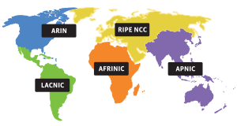
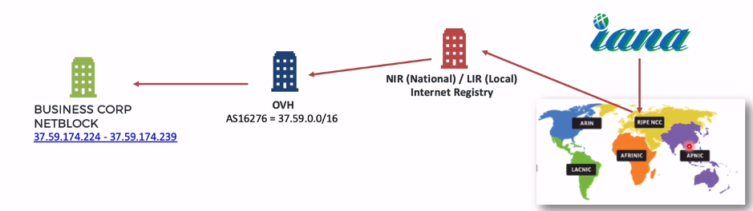

# Internet **Assigned** **Numbers** Authority

#### IANA

Responsável por coordenar alguns dos elementos chaves para manter a internet operacional:

* Gerenciamento dos Root Servers (Domain Numbers)
* Coordenaçã de números IP e ASN (Autonomous System Numbers)
* Registro de protocolos

---

### Links úteis:

[iana.org](https://iana.org)

[iana.org/domains/root/servers](https://iana.org/domains/root/servers)

[iana.org/numbers](https://iana.org/numbers)

---

### RIR's (Regional Internet Registries)

| **REGISTRY** | **AREA** **COVERED**                        |
| ------------ | ------------------------------------------- |
| AFRINIC      | *Africa region*                             |
| APNIC        | *Asia/Pacific region*                       |
| ARIN         | *Canada, USA, and some Caribbean Islands*   |
| LACNIC       | *Latin America and some Caribbean Islands*  |
| RIPE NCC     | *Europe; the Middle East, and Central Asia* |

# Netblock x ASN

**Netblock (Bloco de rede):** Um range ou conjunto de endereços IP.

**Autonomous System (Sistema Autonomo):** Um ou mais blocos de rede sob o mesmo administrador

### Exemplo:

* Se a empresa precisa de um range com 12 IPs ela pode comprar um Netblock.
* Se a empresa precisa de centenas de endereços IPs ela pode comprar um ASN.

Exemplo acima: IP =37.59.174.225 disponibilizado pelo OVH e sob responsabilidade do NIR que é gerido pelo (RIR) RIPE NCC que é coordenado pela IANA.

### IANA>>RIPE NCC>>NIR>>OVH>>Businesscorp
