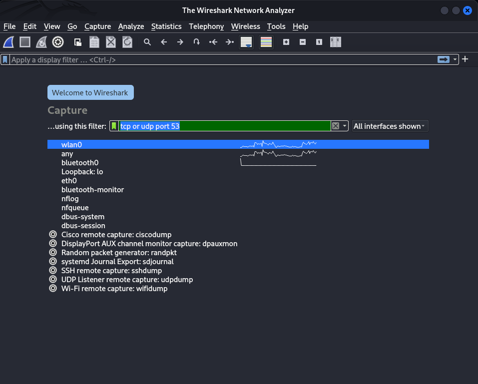
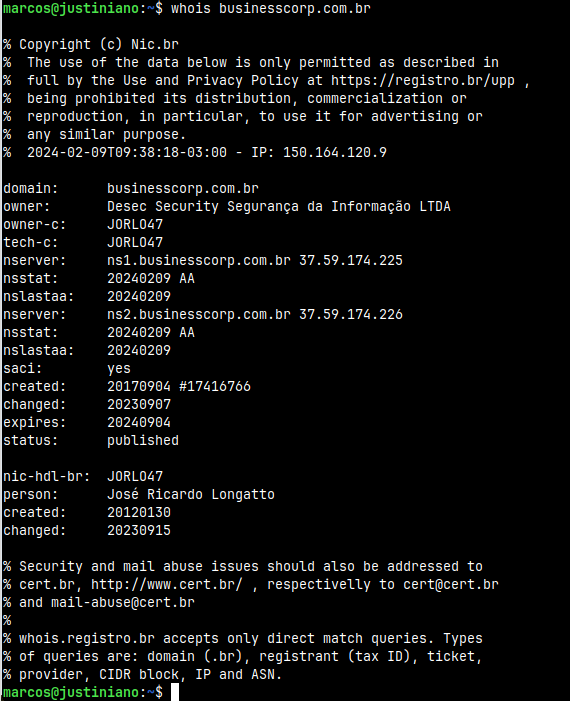
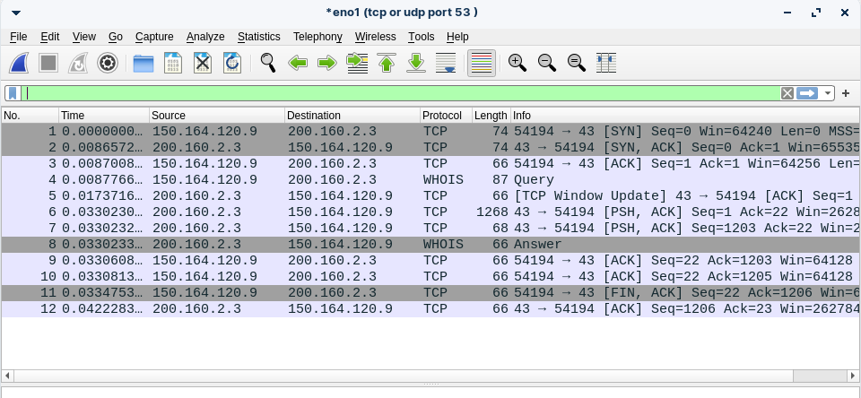
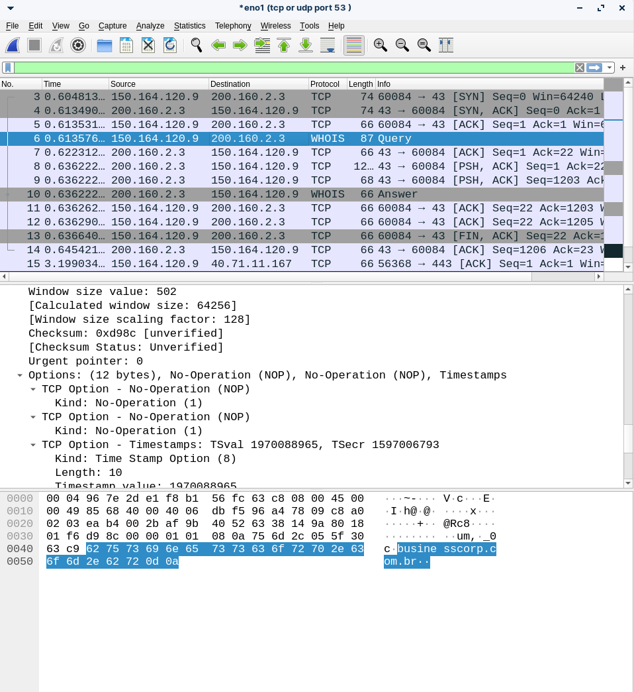
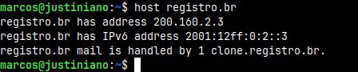
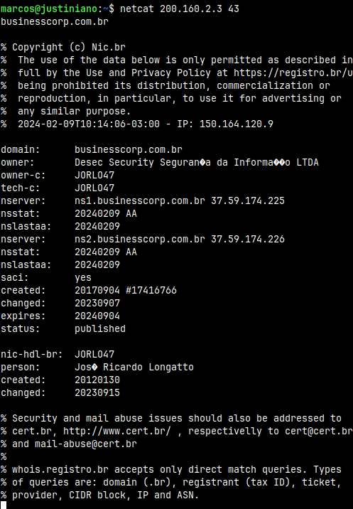

# ESTUDANDO LIKE A PRO - WHOIS

### Estudando o funcionamento do WHOIS:

**Iniciando a captura dos pacotes de comunicação da rede com o wireshark:**

> Note que usamos o filtro "tcp or udp port 53", isso porque a porta 53 é a porta de DNS.

> Em seguida, iniciamos a captura e fazemos varias buscas com o whois, tudo pelo terminal, enquanto o wireshark continua fazendo sua captura.

---

### Após iniciarmos a captura com os filtros mostrados acima, e fazermos a busca pelo whois, temos os seguintes resultados:

### Entendendo a captura do wireshark:

> Nas primeiras três linhas  a minha máquina tenta estabelecer uma conexão TCP com um servidor DNS, isso é feito atraves do chamdado "three-way handshake"

> Na linha 4 minha maquina faz uma query, agora utilizando o protocolo WHOIS para o responsavel pelo dominio informado.

> Nas linhas 5, 6 e 7 o serviço WHOIS tenta connexão com minha maquina, mais uma vez com o three-way handshake TCP.

> Na linha 8, após estabelecer com sucesso a conexão, ele envia a resposta atraves do protocolo WHOIS. Essa resposta é a mesma mostrada no terminal.

> Nas linhas seguintes as máquinas confirmam o recebimento e em seguida encerram a conexão

---

# Fazendo as query's "manualmente":

Na imagem acima, percebemos que o whois faz a query para o endereço de ip 200.160.2.3, que é o ip do registro.br, responsável pelo dominio buscado. Podemos confirmar essa informação na seguinte busca:

> Como podemos confirmar, o endereço realmente é esse.

### Fazendo a comunicação com o servidor do registro.br:

> Note que fazemos a comunição na porta 43, porta TCP que funciona o protocolo WHOIS

Após fazermos a comunicação com o seguinte comando `netcat 200.160.2.3 43`, a conexão é estabelecida e entã podemos fazer a query desejada, tendo como resultado a saída esperada.
